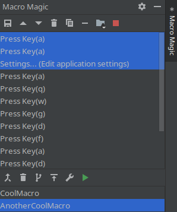

# MacroMagic

Improves on the existing Macro implementation in Intellij Idea!

  * It adds an extensive list of edit features (split, combine, extract, copy, insert, rearrange etc.)
  * Automatically records all actions into a history, without needing to activate it (can be turned off)
  * Nested Macros
  * Nice GUI features
  * Util actions for macros: JumpToClassName, JumpToAnnotations etc

